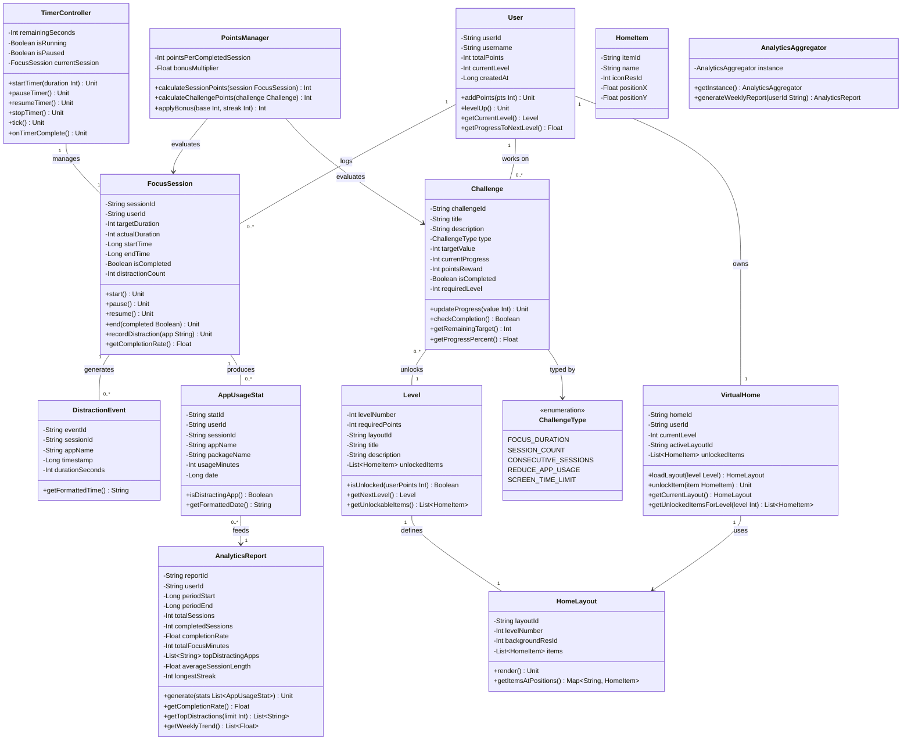

Gamified Focus System – Architecture Documentation
1.Scope
The Gamified Focus System is an Android mobile application designed to help students improve their focus and productivity through timed study sessions. The app gamifies the experience by awarding points for completing sessions, tracking distractions, allowing users to level up, and unlocking items for a customizable virtual home.
The project focuses on core features such as focus timer management, distraction detection using Android's UsageStatsManager, a points and leveling system, a virtual home that evolves as the user progresses, a gamified challenge system, and weekly analytics reports.
Advanced features such as social multiplayer, cloud sync across devices, in-app purchases, and real-time collaboration are outside the scope of this project. The goal is to keep the system focused, maintainable, and well-structured for an academic software engineering project.

2.References

https://www.cs.ubc.ca/~gregor/teaching/papers/4+1view-architecture.pdf
https://en.wikipedia.org/wiki/4%2B1_architectural_view_model
https://developer.android.com/topic/libraries/architecture/viewmodel
https://developer.android.com/training/data-storage/room
https://developer.android.com/topic/libraries/architecture/workmanager

3.Software Architecture
The system is designed using a clean MVVM (Model-View-ViewModel) layered architecture for the Android application. This separates the user interface, business logic, and data access into distinct layers that are easy to maintain, test, and extend.
It includes:

UI Layer: Jetpack Compose screens that the student interacts with
ViewModel Layer: Manages UI state and coordinates between UI and data
Repository Layer: Single source of truth for all data operations
Domain Layer: Core business logic classes (FocusSession, User, Challenge, etc.)
Data Layer: Room local database with DAOs for persistence
External Services: UsageStatsManager (distraction detection), WorkManager (background jobs)

This approach keeps the system organized, testable, and easy to extend with new features.

4.Architectural Goals and Constraints
Goals

Provide a clean and intuitive focus timer experience
Motivate students through gamification (points, levels, challenges, virtual home)
Accurately track distracting app usage during sessions
Support offline-first operation with local persistence
Generate automated weekly productivity reports
Allow new challenge types to be added without modifying existing code

Constraints

Android mobile application only
Offline-first: all core features work without internet
No internal social or messaging system
No payment systems or external APIs (cloud export is optional and opt-in)
Requires Android permission to access UsageStatsManager
Designed as an academic software engineering project

5.Logical Architecture
The logical architecture describes the main functional components of the Gamified Focus System and how responsibilities are distributed between them. It focuses on major abstractions and class relationships rather than implementation details.
The system is divided into four main packages: focus, gamification, home, and analytics.
Main Packages and Responsibilities
focus — Handles all timer and session logic

TimerController manages the countdown, distraction checks, and emits ticks every second
FocusSession represents a single timed study session with all its metadata
DistractionEvent records each time a distracting app was detected

gamification — Handles all reward and progression logic

User holds total points, current level, and progression state
Level defines the requirements and rewards for each level
Challenge tracks progress toward a specific goal using a pluggable evaluator
ChallengeEvaluator is an interface implemented by different evaluator strategies
PointsManager calculates points earned from sessions with multipliers and bonuses
ChallengeType is an enum listing all supported challenge types

home — Handles the virtual home feature

VirtualHome holds the active layout and all unlocked items
HomeLayout defines the grid layout for a given level
HomeItem represents a decorative item such as a tree or fountain

analytics — Handles usage statistics and reporting

AppUsageStat stores per-app usage data collected during sessions
AnalyticsAggregator generates weekly reports from session and usage data
AnalyticsReport holds all calculated metrics for a given week  

Layered Class Diagram
The following diagram shows the main classes of the Gamified Focus System and their relationships across all four packages. 

Strategy Pattern — Challenge Evaluator
The Challenge class holds a reference to the ChallengeEvaluator interface. Different challenge types are handled by different concrete evaluator classes:

FocusDurationEvaluator — checks total focus minutes accumulated
SessionCountEvaluator — checks number of completed sessions
AppUsageEvaluator — checks whether distracting app usage has been reduced

This design allows new challenge types to be added by creating a new evaluator class without modifying the Challenge class or any existing evaluators. This satisfies the Open/Closed Principle. 
